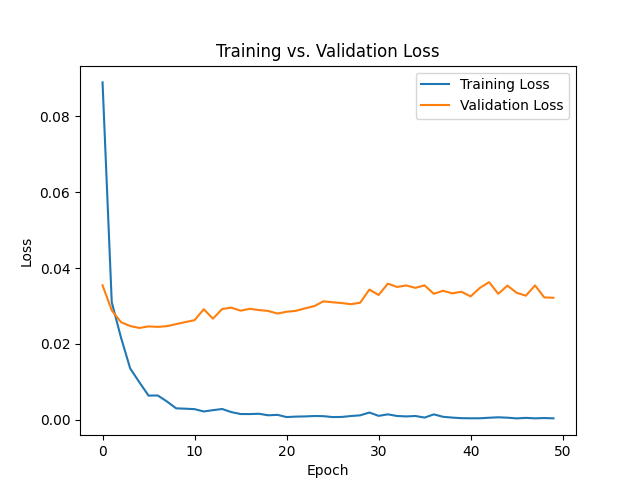
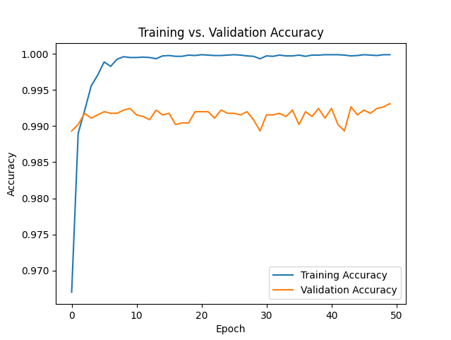
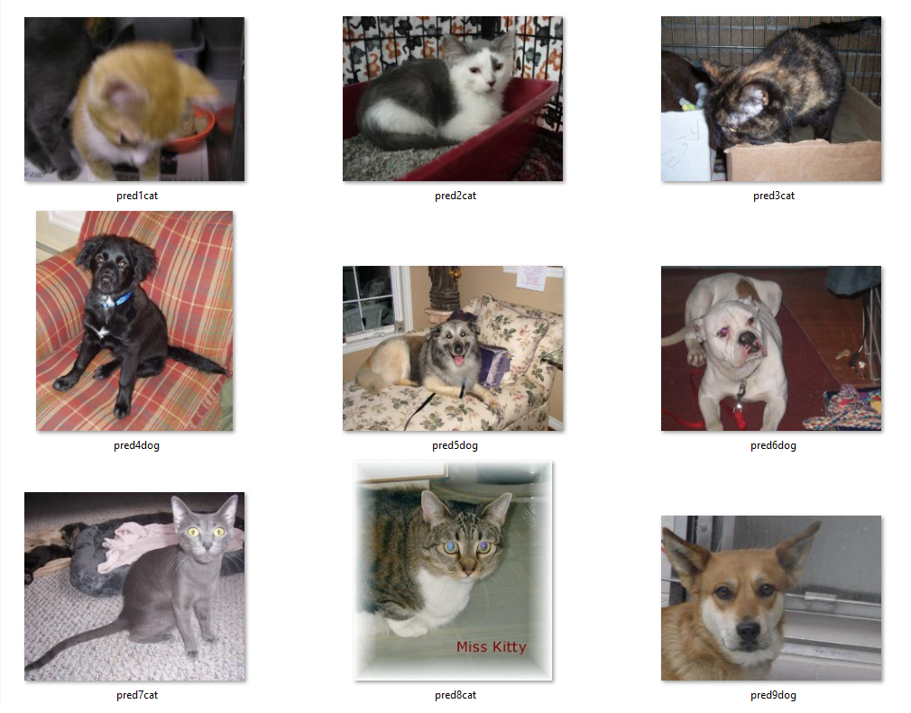

# DogsVsCats
Machine Learning Project with focus on Computer Vision and Data Handling. Uses deep-learning based on Convolutional Neural Networks(CNNs) with PyTorch. Dataset used can be found [here](https://download.microsoft.com/download/3/e/1/3e1c3f21-ecdb-4869-8368-6deba77b919f/kagglecatsanddogs_5340.zip).

## Instructions to Run:
Ensure Python is installed on computer
For a Windows computer open the command prompt from folder holding “src” and “data” folder and run the following commands or run the “startup.bat” file. The following commands and the .bat file are used to set up a virtual environment, activate it and install the required dependencies.<br> 
```
    python -m venv venv<br>
    .\venv\Scripts\activate<br>
```
To use CPU for processing:<br>
```
	pip install torch torchvision matplotlib numpy tqdm pillow 
```
If you have a GPU you can use the following commands to use it for processing:<br>
```
    pip install torch torchvision --index-url https://download.pytorch.org/whl/cu126 
    pip install matplotlib numpy tqdm pillow 
```
Once all the above is set up, you can run the code with the following command from the same directory<br>
```
    python src\main.py
```

## Requirements
* Python 3.13.7
* matplotlib 3.10.8
* NumPy 2.4.1
* PIL 12.1.0
* torch 2.10.0
* torchvision 0.25.0


## Results
Final Training Loss: 0.039%<br>
Final Training Accuracy: 99.988%<br>
Final Validation Loss: 3.219%<br>
Final Validation Accuracy: 99.31%


### Line Graphs showing training and validation improvment over epochs



### Example Images with Predictions

